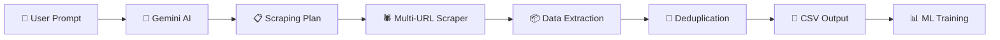

# 🤖 CrawlLM — AI-Powered Intelligent Web Data Collector

<p align="center">
  <strong>Tell CrawlLM what you want to build → It scrapes training data from the internet automatically.</strong>
</p>

<p align="center">
  
  
  
  
</p>

---

## 📖 What is CrawlLM?

CrawlLM is an **AI-powered web scraping tool** designed to collect training data for Machine Learning models. Instead of manually finding URLs, writing scrapers, and cleaning data — you simply **describe what you want to build**, and CrawlLM handles everything:

1. 🤖 **Gemini AI** analyzes your request and creates a smart multi-source scraping plan
2. 🕷️ **Powerful Scraper** crawls multiple free websites with retry logic & rate limiting
3. 📊 **Structured Data** is extracted, deduplicated, and saved to CSV
4. 🖥️ **Rich Terminal Output** shows live progress with details on every source

---

## ✨ Features

| Feature | Description |
|---------|-------------|
| 🤖 **AI-Powered Planning** | Gemini AI understands your intent and picks the best data sources |
| 🌐 **20+ Free Sources** | Books, quotes, jobs, news, products, Wikipedia, GitHub, and more |
| 🔄 **Multi-Source Scraping** | Scrapes 5-15+ URLs per request for maximum data |
| 📄 **Pagination Support** | Automatically crawls multiple pages of paginated sites |
| 🧹 **Auto-Deduplication** | Removes duplicate rows using content hashing |
| 🔁 **Retry with Backoff** | Exponential backoff on failures (3 retries per URL) |
| 🎭 **User-Agent Rotation** | Rotates between 6 realistic browser User-Agents |
| 📦 **Structured Extraction** | Recognizes books, quotes, jobs, products, HN stories patterns |
| 📊 **Table Extraction** | Extracts HTML tables with proper column headers |
| 🖥️ **Rich Terminal Output** | Live progress with emojis, source names, row counts |
| 💾 **CSV Export** | Main output + timestamped backup CSVs |
| 🌐 **REST API** | FastAPI server with `/scrape` endpoint |
| 📋 **Data Summary** | Breakdown by source and type after collection |

---

## 🚀 Quick Start

### 1. Clone & Install

```bash
git clone https://github.com/your-username/CrawlLM_v1.git
cd CrawlLM_v1

# Create virtual environment (recommended)
python -m venv venv
venv\Scripts\activate  # Windows
# source venv/bin/activate  # macOS/Linux

# Install dependencies
pip install -r requirements.txt
```

### 2. Set Up API Key

Create a `.env` file in the project root:
```env
GEMINI_API_KEY=your_gemini_api_key_here
```

> 💡 Get a free Gemini API key at [ai.google.dev](https://ai.google.dev/)

### 3. Run the CLI

```bash
cd src
python main.py
```

You'll see the interactive prompt:

```
╔═══════════════════════════════════════════════════════════╗
║    ██████╗██████╗  █████╗ ██╗    ██╗██╗     ██╗     ███╗ ║
║   ██╔════╝██╔══██╗██╔══██╗██║    ██║██║     ██║     ████║ ║
║   ╚██████╗██║  ██║██║  ██║╚███╔███╔╝███████╗███████╗██║  ║
╚═══════════════════════════════════════════════════════════╝

🎯 Your prompt: I want to build a book recommendation system
```

### 4. Run the API Server (Optional)

```bash
python server.py
# Server starts at http://localhost:8000
```

```bash
# Example API call
curl -X POST http://localhost:8000/scrape \
  -H "Content-Type: application/json" \
  -d '{"prompt": "I need data for sentiment analysis"}'
```

---

## 📁 Project Structure

```
CrawlLM_v1/
├── .env                          # API keys (not tracked by git)
├── .gitignore                    # Git ignore rules
├── requirements.txt              # Python dependencies
├── server.py                     # FastAPI REST API server
├── readme.md                     # This file
├── output/                       # CSV output files
│   ├── output.csv                # Main data output
│   └── crawl_20260507_*.csv      # Timestamped backups
├── logs/                         # Application logs
│   └── 05_07_2026_*.log          # Timestamped log files
└── src/
    ├── main.py                   # CLI entry point
    ├── utils.py                  # CSV saving, deduplication, summaries
    ├── exception.py              # Custom exception handling
    ├── logger_config.py          # Logging configuration
    ├── component/
    │   ├── gemni_model.py        # Gemini AI integration & prompt engineering
    │   └── web_scraper.py        # Multi-source web scraping engine
    ├── pipline/                  # (Reserved for future ML pipelines)
    └── artifacts/                # Model artifacts storage
```

---

## 🌐 Supported Free Data Sources

CrawlLM scrapes data from **100% free, publicly accessible websites**:

| Category | Sources | Data Available |
|----------|---------|---------------|
| 📰 **News** | HackerNews, CNN Lite, NPR Text, Lobsters | Headlines, stories, scores, links |
| 📚 **Books** | books.toscrape.com (50 pages) | Titles, prices, ratings, categories |
| 💬 **Quotes** | quotes.toscrape.com (10 pages) | Quotes, authors, tags |
| 💼 **Jobs** | realpython.github.io/fake-jobs | Titles, companies, locations, dates |
| 🛒 **Products** | webscraper.io test sites | Names, prices, descriptions, ratings |
| 🌐 **Wikipedia** | en.wikipedia.org | Any topic — paragraphs, tables, lists |
| 💻 **GitHub** | api.github.com | Repositories, stars, descriptions |
| 📊 **Statistics** | worldometers.info | World data, population, economics |

---

## 📊 Example Output

When you run CrawlLM with a prompt like:

```
🎯 Your prompt: I want to build a book recommendation system
```

The terminal shows:

```
======================================================================
🤖  STEP 1: Analyzing your request with Gemini AI...
======================================================================

📋  AI SCRAPING PLAN:
----------------------------------------------------------------------
  Project     : Book recommendation system
  Data Type   : books
  Strategy    : paginated
  Est. Rows   : 1000
  URLs to scrape: 10
----------------------------------------------------------------------

  Sources:
    1. [Books Page 1] https://books.toscrape.com/catalogue/page-1.html
    2. [Books Page 2] https://books.toscrape.com/catalogue/page-2.html
    ...

======================================================================
🕷️  STEP 2: Scraping data from all sources...
======================================================================

============================================================
🌐 [1/10] Scraping: Books Page 1
   URL: https://books.toscrape.com/catalogue/page-1.html
============================================================
  📡 Fetching: ... (attempt 1/3)
  ✅ Success: 200 | Size: 51,243 bytes
  📦 Found 20 structured items
  📌 Found 5 headings
  📊 Collected 35 rows from Books Page 1
  ⏳ Rate limiting: waiting 1.8s...

... (continues for all 10 pages)

======================================================================
📊  DATA COLLECTION SUMMARY
======================================================================

  Total rows collected  : 487
  Total columns         : 6
  Columns               : source, type, text, price, rating, href

  📡 Data by Source:
     • Books Page 1: 35 rows
     • Books Page 2: 34 rows
     ...

  ✅ DONE! Collected 487 rows of data for your ML model.
======================================================================
```

---

## 🔧 How It Works



1. **User Input** — Describe what you want to build (e.g., "book recommendation system")
2. **AI Planning** — Gemini AI picks the best free sources and generates a multi-URL plan
3. **Scraping** — The engine crawls each URL with retries, rotating User-Agents, and rate limiting
4. **Extraction** — Structured patterns (books, quotes, jobs, etc.) are detected and extracted
5. **Deduplication** — Content-hash-based dedup removes duplicate rows
6. **Output** — Data is saved to `output/output.csv` + a timestamped backup

---

## 🛠️ Technologies Used

| Technology | Purpose |
|-----------|---------|
| **Python 3.10+** | Core language |
| **Google Gemini AI** | Intelligent scraping plan generation |
| **BeautifulSoup4** | HTML parsing and extraction |
| **lxml** | Fast HTML/XML parser |
| **Requests** | HTTP client with retry logic |
| **Pandas** | Data processing and CSV export |
| **FastAPI** | REST API server |
| **Uvicorn** | ASGI server |

---

## 🧪 Example Prompts

| Prompt | What It Scrapes |
|--------|----------------|
| "I want to build a book recommendation system" | 500+ books with titles, prices, ratings from multiple pages |
| "I need data for sentiment analysis on tech news" | News headlines from HN, CNN, NPR, Lobsters |
| "I want to build a job matching ML model" | Job listings with titles, companies, locations |
| "Collect product data for price prediction" | Product names, prices, descriptions, ratings |
| "I need quotes data for NLP text classification" | 100+ quotes with authors and tags |
| "Build a chatbot about world statistics" | Wikipedia data, worldometers tables |

---

## 📄 API Reference

### `POST /scrape`

**Request Body:**
```json
{
    "prompt": "I want to build a book recommendation system",
    "save_csv": true
}
```

**Response:**
```json
{
    "status": "success",
    "total_rows": 487,
    "sources_scraped": 10,
    "csv_path": "output/output.csv",
    "sample_data": [...]
}
```

### `GET /health`
```json
{"status": "healthy", "version": "2.0.0"}
```

---

## 📝 What Was Enhanced (v2 Changelog)

- ✅ **Gemini AI prompt completely rewritten** — now generates multi-URL scraping plans with 5-15 sources
- ✅ **20+ free data sources** cataloged and integrated (books, quotes, jobs, news, products, Wikipedia, GitHub)
- ✅ **Structured content extraction** — detects books, quotes, jobs, products, HackerNews patterns automatically
- ✅ **Table extraction** — parses HTML tables with proper column headers
- ✅ **Paragraph, heading, list extraction** — captures all text content from pages
- ✅ **User-Agent rotation** — 6 realistic browser agents to avoid blocking
- ✅ **Retry logic with exponential backoff** — 3 retries per URL
- ✅ **Rate limiting** — random delays between requests to be polite
- ✅ **Deduplication** — content-hash-based dedup removes identical rows
- ✅ **Rich terminal output** — live progress with source names, row counts, emojis
- ✅ **Data summary** — breakdown by source and type after collection
- ✅ **Timestamped backup CSVs** — never lose data
- ✅ **Output directory** — organized file storage
- ✅ **Interactive CLI loop** — keep collecting data without restarting
- ✅ **FastAPI REST API** — `/scrape` endpoint for programmatic access
- ✅ **Smart fallback** — if AI fails, keyword-based URL selection kicks in
- ✅ **Fixed .env format** — proper `KEY=VALUE` format
- ✅ **Fixed logger** — logs to both file AND terminal

---

## 📜 License

MIT License — feel free to use, modify, and distribute.

---

<p align="center">
  Made with ❤️ for ML engineers who need more training data.
</p>